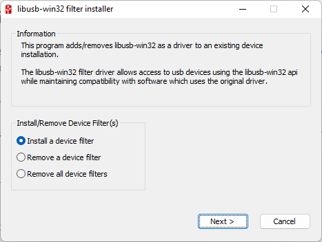
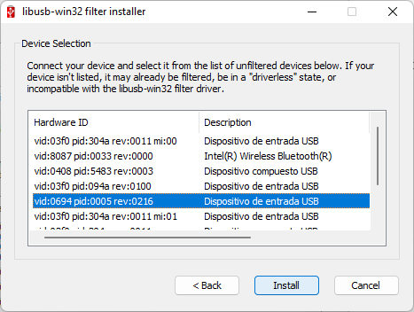

# Conexión usando USB

Para conectar el LEGO EV3 por USB al PC, necesitaremos tener un programa adicional instalado:

1. Instalar el software [LibUSB para Windows](https://sourceforge.net/projects/libusb-win32/files/libusb-win32-releases/1.2.6.0/libusb-win32-devel-filter-1.2.6.0.exe/download). Este programa nos ayudará a que la conexión USB sea reconocida por PyUSB en Python. 

    Para instalar el LEGO EV3 usaremos el **Filter Wizard**, abrimos la aplicación

    

    hacemos clic en siguiente, seleccionamos el EV3 (el cual debe estar conectado al PC y prendido, el VID problamente es `0694`)

    

    y lo instalamos.

2. Verificar la conexión del LEGO EV3:

    Para la verificación usaremos el siguiente [código](./ejemplos/ev3-usb--test.py), recordemos activar el ambiente virtual.

    ```python
    import ev3_dc as ev3

    with ev3.EV3(protocol=ev3.USB) as my_robot:
        print(my_robot)
    ```

    Código tomado de la documentación de [ev3-dc](https://ev3-dc.readthedocs.io/en/latest/)

4. Probemos un codigo para mover un motor conectador en el Puerto A:

    El código de prueba lo podemos descargar de [aquí](./ejemplos/ev3-usb--move-motor-a.py), que es igual al mostrado a continuación, Debemos cambiar la dirección MAC del LEGO por la correcta.

    ```python
    import ev3_dc as ev3

    with ev3.EV3(protocol=ev3.USB, host='00:16:53:50:8A:86') as brick:
        print(brick)
        # Conectar el motor en el Puerto A
        my_motor = ev3.Motor(ev3.PORT_A, ev3_obj=brick)
        print("Presiona Ctrl-C para interrumpir el programa")
        while True:
            # Hará una rotación completa en una dirección
            my_motor.start_move_to(360, speed=25)
            while my_motor.busy:
                pass
            # Hará una rotación completa en la otra dirección
            my_motor.start_move_to(0, speed=25)
            while my_motor.busy:
                pass
    ```

Para más información de las funciones que se pueden usar consultar la [**documentación**](https://ni.srht.site/EV3-python/latest/api/index.html).