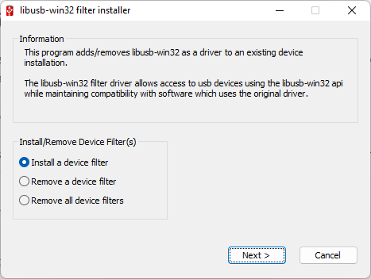

# Conexión usando USB

Para conectar el LEGO NXT por USB al PC, necesitaremos tener dos programas adicionales instalados:

1. Instalar el [Controlador Fantom para NXT](https://www.lego.com/cdn/cs/set/assets/bltea140e66e32fadf0/NXT_Fantom_Drivers_v120.zip) que pudiste descargar directamente del enlace anterior o de la [página de LEGO](https://www.lego.com/es-es/themes/mindstorms/downloads). Una vez instalador el controlador. 
2. Instalar el software [LibUSB para Windows](https://sourceforge.net/projects/libusb-win32/files/libusb-win32-releases/1.2.6.0/libusb-win32-devel-filter-1.2.6.0.exe/download). Este programa nos ayudará a que la conexión USB sea reconocida por PyUSB en Python. 

    Para instalar el LEGO NXT usaremos el **Filter Wizard**, abrimos la aplicación

    

    hacemos clic en siguiente, seleccionamos el NXT (el cual debe estar conectado al PC y prendido)

    

    y lo instalamos.

3. Verificar la conexión del LEGO NXT:

    Para la verificación usaremos el siguiente [código](./ejemplos/nxt-usb--find-brick.py), recordemos activar el ambiente virtual.

    ```python
    import nxt.locator
    # Find a brick.
    with nxt.locator.find() as b:
        # Once found, print its name.
        print("Found brick:", b.get_device_info())
        # And play a recognizable note.
        b.play_tone_and_wait(440, 10000)
    ```

    Código tomado de la documentación de [nxt-python](https://ni.srht.site/nxt-python/latest/handbook/tutorial.html)

4. Probemos un codigo para mover un motor conectador en el Puerto A:

    El código de prueba lo podemos descargar de [aquí](./ejemplos/nxt-usb--move-motor-a.py), que es igual al mostrado a continuación, Debemos cambiar la dirección MAC del LEGO por la correcta.

    ```python
    import nxt.locator
    import nxt.motor

    with nxt.locator.find() as b:
        # Conectar el motor en el Puerto A
        my_motor = b.get_motor(nxt.motor.Port.A)
        print("Presiona Ctrl-C para interrumpir el programa")
        while True:
            # Hará una rotación completa en una dirección
            my_motor.turn(25, 360)
            # Hará una rotación completa en la otra dirección
            my_motor.turn(-25, 360)
    ```

Para más información de las funciones que se pueden usar consultar la [**documentación**](https://ni.srht.site/nxt-python/latest/api/index.html).